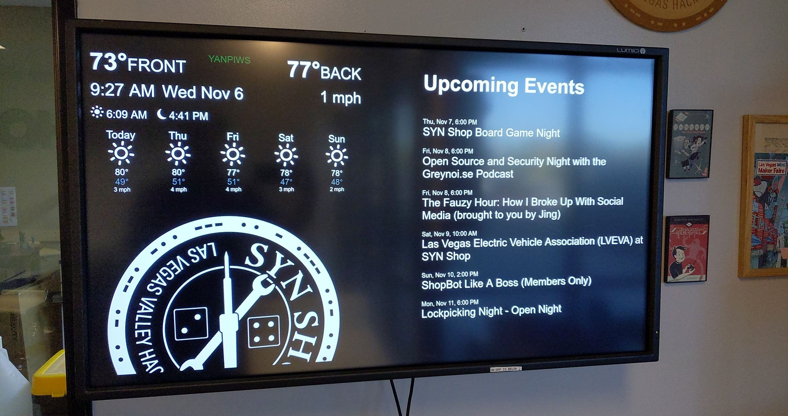

# Front Kiosk Display 

How to build this:

## Bill of Materials

  * Big ass wall mounted TV with HDMI in
  * [Raspberry Pi](https://amzn.to/33o36mT) with WiFi HDMI out and I2C pins
  * [BME280 I2C temp sensor](https://amzn.to/33otoFK)
  * [0.96" I2C OLED Display with SSD1306 driver](https://amzn.to/2rm4vMV)
  * [Jumper Cables](https://amzn.to/2ClLPit)

## Hardware build out

  1. Make [a harness](../images/harness.jpeg) to connect the OLED display and the BME280 at the same time. 
    Connect the OLED and sensor to the right pins on the Pi
  1. Connect the HDMI cable to the large monitor
  1. Fabricate a case for the Pi, OLED and sensor like shown above - but up to you how this looks ;)
  1. Fabricate a sign with the info and QR code
  1. Mount the monitor and Pi set up to the wall
  
## Software set up

  1. Install [latest Rasbpian](https://www.raspberrypi.org/downloads/) on and SD card. Insert it into the Pi. After
     first boot, configure WiFi to be on the shop's LAN, run `sudo apt update;sudo apt dist-upgrade`
  1. Give the Pi a static IP by following 
    [these steps](https://thepihut.com/blogs/raspberry-pi-tutorials/how-to-give-your-raspberry-pi-a-static-ip-address-update).
  1. Change the `pi` user password to something random, add administrators SSH keys to `pi` user
    and harden SSH by editing `/etc/ssh/sshd_conf` and changing it to not allow passwords via 
    `PasswordAuthentication no`. Restart ssh with `systemctl restart sshd`
  1. Install and configure [YANPIWS](https://github.com/Ths2-9Y-LqJt6/YANPIWS) per the sites instructions
  1. Enable the OLED to show the real time temps for the BME280 via 
    [these instructions](https://github.com/Ths2-9Y-LqJt6/YANPIWS/tree/master/I2C.bme280.oled#quick-start)
  1. Create `/var/www/html/dashboard/` and put a copy of `MeetupEvents.php` in it from 
    [this gist](https://gist.github.com/Ths2-9Y-LqJt6/b588352f29b46af639c09891eaee13d2)
  1. Grab a copy of the files on [this gist](https://gist.github.com/Ths2-9Y-LqJt6/e563f95f9b4e4bae8d0a20e87515b056)
      and put them in `/var/www/html/dashboard/`
  1. save a copy of `synshop.logo.v4.svg` from our 
    [logo page](https://rtfm.synshop.org/images/logos/synshop.logo.v4.svg) into `/var/www/html/dashboard/` 
  1. Have the Pi use a full screen browser service pointing to `http://127.0.0.1/dashboard/` per 
    [these steps](https://pimylifeup.com/raspberry-pi-kiosk/).
  1. enjoy!